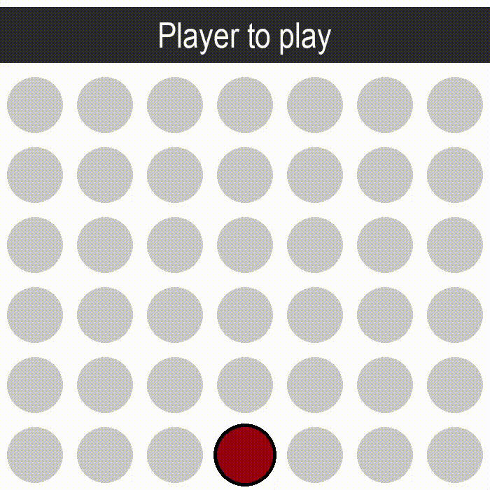

# Pygame-Get-4-in-a-row-Game

Player vs AI 4-in-a-row game made with Pygame. First game game made ever, first time using the pygame framework. Made individually without following tutorials.

To use:
Download all the files and ensure that they are in the same folder. Run the main python file to start the game.

Sound effect credits:

All sound effects were found on freesound.org licensed under the Creative Commons 0 License.

switch 17.wav by patchytherat
August 18th, 2020

game over by Leszek_Szary
November 4th, 2011

Bit Forest Intro music by Bertsz
November 19th, 2020

